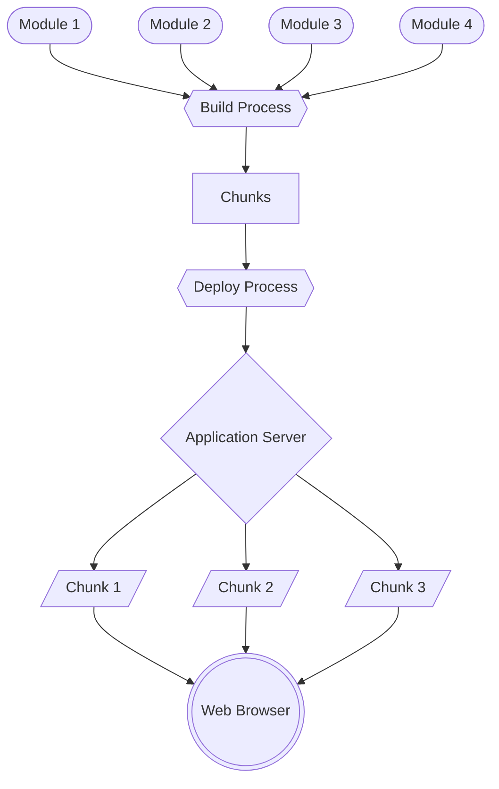
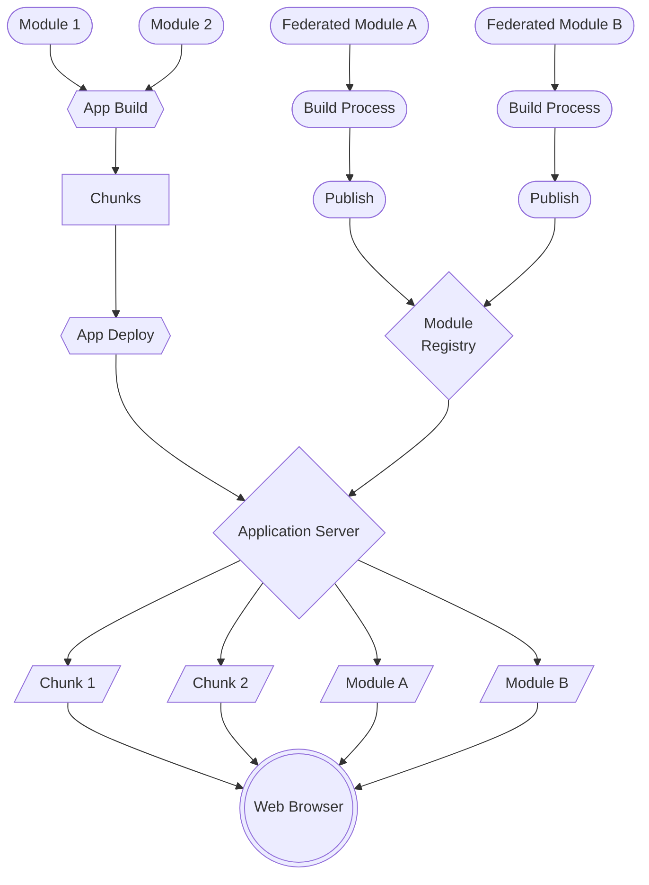

 
# Module Federation In Esperanto

<blockquote>I love waiting on builds and pipelines prior to testing my changes in flaky environments and being dependent on the success of other teams' features in order to get my features in front of customers!</blockquote>

– <cite>no developer or product manager ever</cite>

Esperanto is a complex single page web application. We wouldn't dare send it to the browser as a single file; the delivery is broken into multiple asynchronously loaded chunks that the browser requests as needed. Teams have made significant efforts to enable and optimize application loading and performance for customers. 

We have also made significant efforts to optimize the developer experience and the time it takes to deliver a change to production. We understand that only operating on code that has changed is a great way to increase velocity; we've introduced caching and limited the scope of local builds and what is tested in pipelines, but the monolithic build and deploy is a significant operational bottleneck that we have yet to overcome.

Module federation is a relatively new pattern that will enable us to break apart the monolithic build and deploy, thus eliminating the constraints of our current operational processes. It will provide teams the ability to develop, build, validate and deploy code independently of the core application while maintaining the benefits of the SPA architecture. With module federation we will be able to deliver features and fixes to our customers more frequently with higher confidence and lower risk.

## What Is Module Federation?
Module federation allows us to compose parts of an application at run-time from independently developed, built and deployed javascript modules. A federated module is similar to a "chunk" artifact of the current Webpack build, but it is decoupled from the build and can therefor be updated independently. A registry of federated modules provides the server and/or web application a map of module sources. A federated module "deployment" is essentially a configuration change that results in the application loading a new remote asset.

### Traditional Build

### Federated Build

## Why Should We Use It?
Module Federation allows us to: 
- Break apart monolithic processes including builds, deploys and rollbacks
- Test changes in any environment, without affecting what customers see
- Deploy smaller focused changes to production with more frequency
- Give teams more ownership of when and how their changes make it to production
- Quickly rollback or fix problematic modules
- Granular rollbacks, only roll back the modules that have issues
- Targeted hot-fixes, if a module needs to be hot-fixed it won't require an application redeploy
- Enables advanced operational patterns
   - A/B testing of versions
   - Canary Deployments
   - Automatic rollbacks
- Potential for code-reuse across applications

## This Sounds Like a Big Change...
...should we be concerned?  No. Federated modules represent a new tool that we can utilize in the existing repository in conjunction with existing pipelines and processes.  It is does not have to be an all-or-none change, we can iterate and follow the paths that deliver the most value.

## How We Might Proceed
A small team consisting of one or more developers would be able to execute all the setup for utilizing module federation in Esperanto.  Additionally there is a good amount of overlap between what will be needed in the banner app and the work the KAP Web Platform team is doing. Beyond the setup phase, the same small team could update all of the existing dynamic splits in the existing app (routes) to utilize Radpack. This change could be set up such that the existing deploy process remains intact (even when fully utilizing module federation); teams could then individually elect to manage their own updates.  Because most if not all of the changes required for module federation using Radpack may initially be obfuscated from the teams, there should be no need for project coordination.

#### 🌱  Planned or Potential Groot work 
#### 🖌  Prior-art Exists

### Phase 1 - Foundation & Testing
- [ ] 🖌 A manually triggered workflow that targets a single federated module in the monorepo
- [ ] 🖌 POC federated module version management via AMP
- [ ] A non-customer facing route/library that utilizes the federated module. 
- [ ] 🖌 Determine if/how we should deliver non-js assets currently associated with routes through a federated module, though we may not have a final solution in place.
- [ ] 🖌 Demonstrate a code update in production
- [ ] 🖌 Demonstrate a rollback in production
- [ ] 🖌 Demonstrate a breaking change in production (noop)

### Phase 2 - Production Readiness
- [ ] 🖌  Non-js assets accounted for
- [ ] 🖌 Reusable workflow in place that can be applied to 0 to N federated modules within the monorepo automatically 
- [ ] 🌱 A more robust federated module registry is in place 
- [ ] 🌱 Workflow updated to make use of registry
- [ ] 🖌 Path to production refined, deploy/rollback workflows added for individual modules
- [ ] 🌱 controls in place for securing module deploys
- [ ] Target initial customer facing module(s) for federation
- [ ] 🖌 Monitor and measure
- [ ] 🌱 Begin Incorporate KAP Web Client for shared capabilities targeting analytics
 
 ### Phase 3 - Rollout
- [ ] Target AMP components for federation
- [ ] Target non-amp modules
- [ ] Continue to monitor and measure
 
### Phase N - Full Utilization and Refinement
- [ ] Evaluate processes and refine as needed
- [ ] Enable automated A/B canary deployments with automated rollback
- [ ] Only core application code should be excluded from federation

## Summary
Module federation in Esperanto will enable us to eliminate operational bottlenecks and deliver value to customers with more confidence, less risk, at a higher velocity than we've ever achieved.  A small team or a few dedicated individuals will be able to make the necessary changes across the entire project with little to no negative impact to ongoing work.  Furthermore, depending on the number of engineers and timing/alignment of the KWC efforts, it is conceivable that this effort could be rolled out across all banner product domains in one quarter.  Given the value that module federation provides and the opportunities it will unlock for both customers and development teams, we should prioritize its implementation in Esperanto.

## Questions
- tree shaking, optimization?
- structure

## Notes
- scope is limited to esperanto modules, not intended to share external to esperanto.
